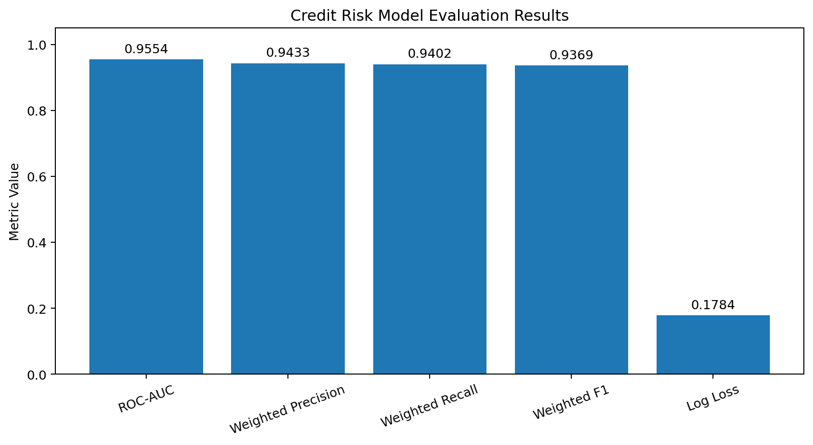
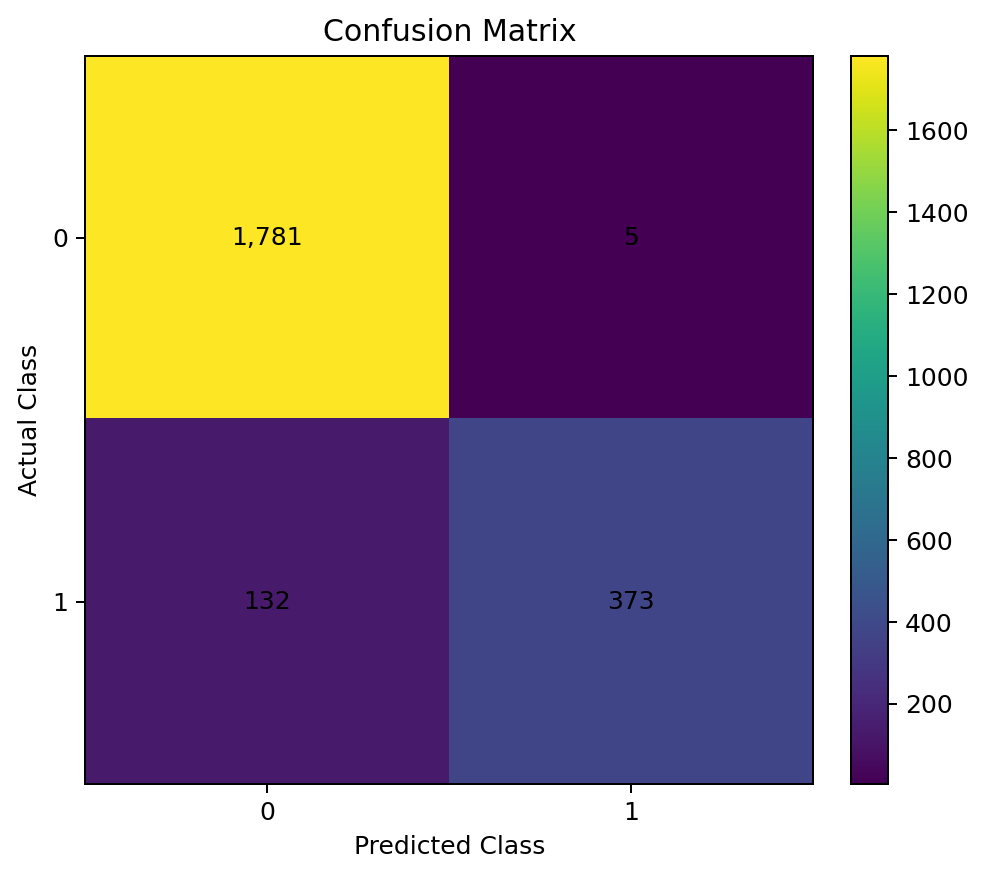
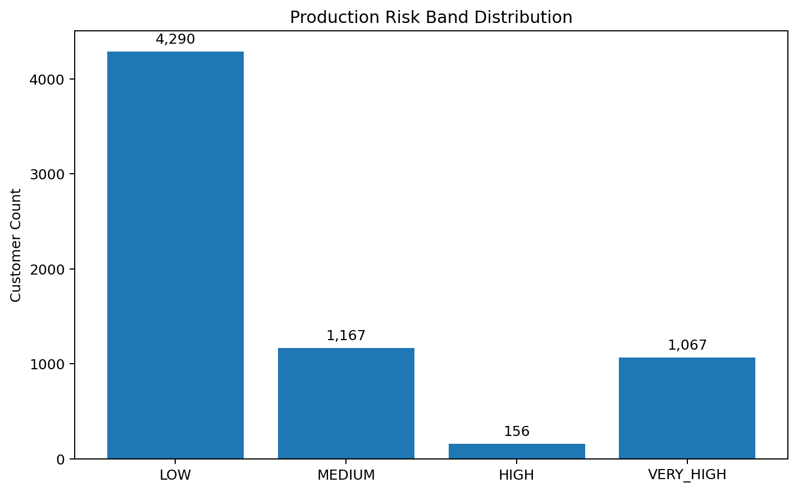
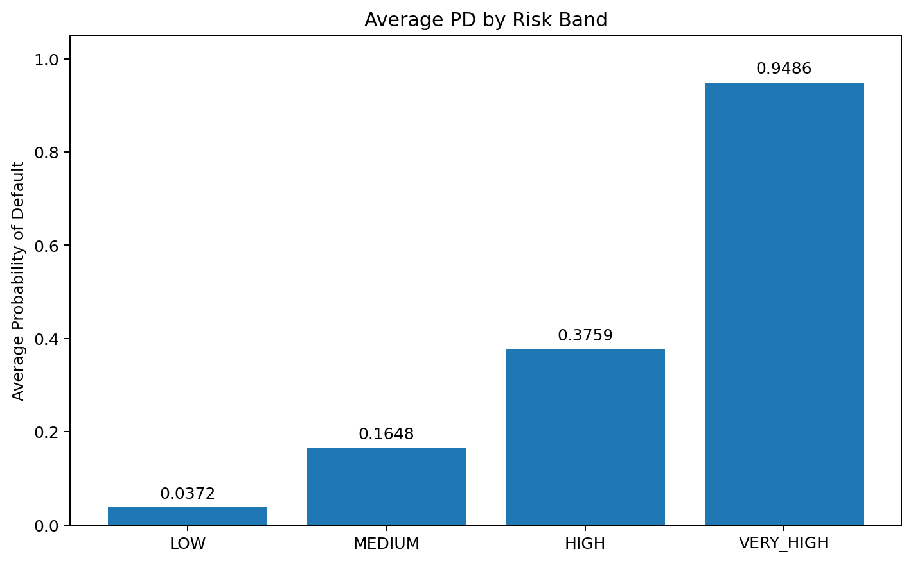
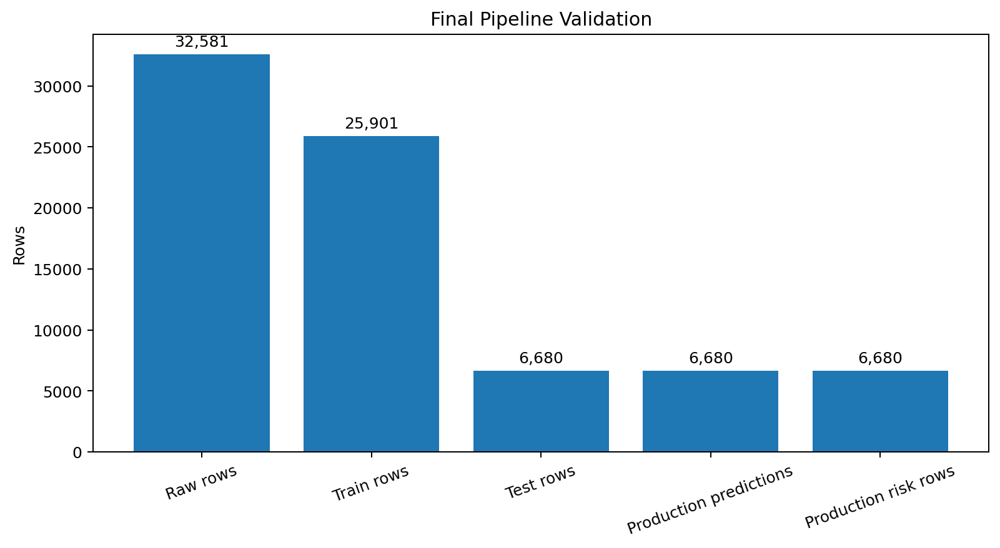

# Credit Risk Prediction and MLOps Using Snowflake

## Project Overview

This project implements an end-to-end **credit risk prediction and MLOps workflow in Snowflake using SQL**.

The objective is to predict loan default risk from borrower and loan information and generate a probability of default (PD) and project-defined risk band.

## ML Problem Type

**Binary Classification**

Target variable:

- `LOAN_STATUS = 0` → No Default
- `LOAN_STATUS = 1` → Default

## Dataset

**Dataset name:** `credit_risk_dataset.csv`

**Source platform:** Public GitHub CSV

**Rows:** 32,581

## Technologies

- Snowflake
- Snowflake SQL
- Snowflake ML
- Snowflake Tables
- Snowflake Views
- Snowflake Stages

## Project Workflow

```text
Credit Risk Dataset
        ↓
Snowflake RAW
        ↓
Data Cleaning
        ↓
Feature Engineering
        ↓
Missing Value Imputation
        ↓
Train / Test Split
        ↓
Categorical Encoding
        ↓
Snowflake ML Classification
        ↓
Prediction
        ↓
Model Evaluation
        ↓
Threshold Analysis
        ↓
Confusion Matrix
        ↓
Production Prediction
        ↓
Probability of Default (PD)
        ↓
Risk Bands
        ↓
Reporting
        ↓
Data Quality Monitoring
        ↓
Final Validation
```

## Snowflake Architecture

```text
CREDIT_RISK_MLOPS
├── RAW
├── FEATURES
├── ML
├── INFERENCE
└── REPORTING
```

## Feature Engineering

The project creates:

- `LOAN_TO_INCOME`
- `INCOME_PER_LOAN`
- `CREDIT_HISTORY_TO_AGE`
- `EMPLOYMENT_TO_AGE`
- `HAS_PREVIOUS_DEFAULT`

Categorical variables are manually encoded for model input.

## Model Used

The implemented SQL-native model is:

**`SNOWFLAKE.ML.CLASSIFICATION`**

Production candidate:

**`CREDIT_RISK_BASELINE`**

A second `SNOWFLAKE.ML.CLASSIFICATION` object was also created for workflow comparison. Both used the same training view/configuration, so this should not be described as a comparison of two different algorithms.

## Model Evaluation

Recorded evaluation results:

| Metric | Value |
|---|---:|
| ROC-AUC | 0.9554 |
| Weighted Precision | 0.9433 |
| Weighted Recall | 0.9402 |
| Weighted F1 | 0.9369 |
| Log Loss | 0.1784 |



## Confusion Matrix

Evaluation-set confusion matrix:

| Actual | Predicted | Count |
|---:|---:|---:|
| 0 | 0 | 1,781 |
| 0 | 1 | 5 |
| 1 | 0 | 132 |
| 1 | 1 | 373 |



## Risk Bands

Production PD is categorized as:

| Risk Band | PD Range |
|---|---|
| LOW | < 0.10 |
| MEDIUM | 0.10 – < 0.30 |
| HIGH | 0.30 – < 0.50 |
| VERY_HIGH | >= 0.50 |

Current production distribution:

| Risk Band | Customers | Average PD |
|---|---:|---:|
| LOW | 4,290 | 0.0372 |
| MEDIUM | 1,167 | 0.1648 |
| HIGH | 156 | 0.3759 |
| VERY_HIGH | 1,067 | 0.9486 |





## Monitoring

The production monitoring checks include:

- Missing input fields
- Missing engineered features
- Missing PD
- PD values outside the 0–1 range
- Missing risk bands
- Risk-band distribution

A total of **174 production records** have missing `EMPLOYMENT_TO_AGE`. All 6,680 production records still received a non-null PD and risk band.

## Final Validation

| Check | Result |
|---|---:|
| Raw rows | 32,581 |
| Training rows | 25,901 |
| Test rows | 6,680 |
| Production predictions | 6,680 |
| Production risk rows | 6,680 |
| Missing PD | 0 |
| Invalid PD values | 0 |
| Missing risk bands | 0 |
| Missing `EMPLOYMENT_TO_AGE` | 174 |



## Repository Structure

```text
credit-risk-snowflake-ml/
├── README.md
├── credit_risk_project.sql
└── images/
    ├── model_metrics.png
    ├── confusion_matrix.png
    ├── risk_band_distribution.png
    ├── average_pd_by_risk_band.png
    └── final_validation.png
```

## How to Run

1. Open a Snowflake SQL Worksheet.
2. Run `credit_risk_project.sql`.
3. Upload the dataset to the Snowflake stage before the data-loading step.
4. Review model evaluation and threshold results.
5. Review production predictions and risk bands.
6. Review reporting and monitoring tables.

## Project Status

**Completed end-to-end SQL-based credit risk ML workflow in Snowflake.**
